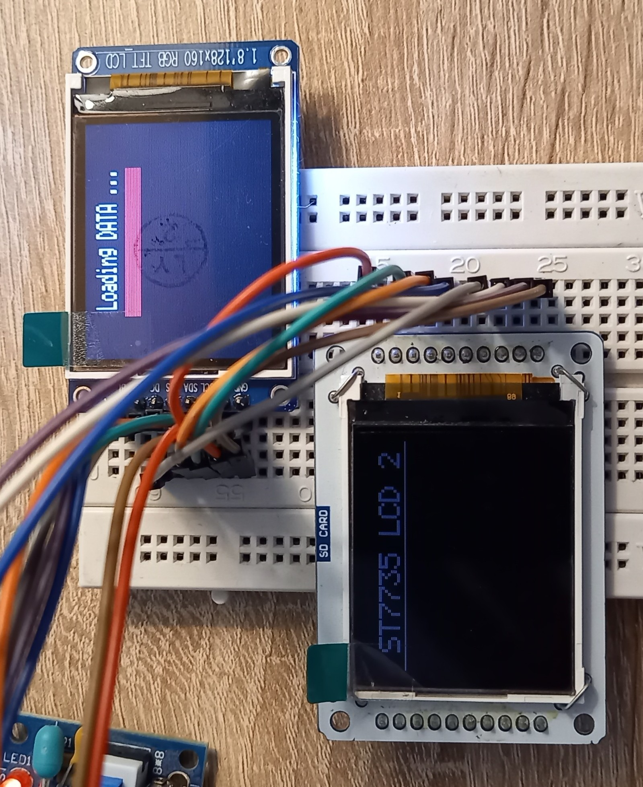

# C Library for ST7735 1.8 TFT LCD display

## ST7735 Description
Detailed information are described in [Datasheet ST7735](http://www.displayfuture.com/Display/datasheet/controller/ST7735.pdf). New version 2.0 allow to connect more than 1 display.

## Library
C library is aimed for driving [ST7735 1.8 TFT LCD display](#demonstration) 162x132 through SPI's Atmega328P / Atmega8 / Atmega16A.

## Hardware connection ATMEGA328P -> LCD1
| PORT LCD | PORT ATMEGA328P | Description |
| :--- | :--- |  :--- |
| RST | PORTD 7 | Chip Reset Signal |
| CS | PORTB 2 | SPI Chip Select |
| D/C | PORTB 0 | SPI data / command; 1=Data, 0=Command |
| DIN | PORTB 3 | SPI Serial data in / MOSI |
| CLK | PORTB 5 | SPI Serial clock signal |
| UCC | +5V | Supply Voltage +5V |
| BL | PORTB 1 | Backlight control (with resistor 40-150 Ohm) |
| GND | GND | Ground |

## Hardware connection ATMEGA328P -> LCD2
| PORT LCD | PORT ATMEGA328P | Description |
| :--- | :--- |  :--- |
| RST | PORTD 3 | Chip Reset Signal |
| CS | PORTD 0 | SPI Chip Select |
| D/C | PORTB 0 | SPI data / command; 1=Data, 0=Command |
| DIN | PORTB 3 | SPI Serial data in / MOSI |
| CLK | PORTB 5 | SPI Serial clock signal |
| UCC | +5V | Supply Voltage +5V |
| BL | PORTD 1 | Backlight control (with resistor 40-150 Ohm) |
| GND | GND | Ground |

### Usage
Prior defined for MCU Atmega16 / Atmega8 / Atmega328P. Need to be carefull with SPI ports definition.

| PORT  | [Atmega16](http://ww1.microchip.com/downloads/en/devicedoc/doc2466.pdf) | [Atmega8](https://ww1.microchip.com/downloads/en/DeviceDoc/Atmel-2486-8-bit-AVR-microcontroller-ATmega8_L_datasheet.pdf)  / [Atmega328](https://ww1.microchip.com/downloads/en/DeviceDoc/ATmega48A-PA-88A-PA-168A-PA-328-P-DS-DS40002061B.pdf) |
| :---: | :---: | :---: |
| SS | PB4 | PB2 |
| MOSI | PB5 | PB3 |
| MISO | PB6 | PB4 |
| SCK | PB7 | PB5 |

### Tested
Library was tested and proved on a **_ST7735 1.8″ TFT Dispay_** with **_Atmega328P_**.
  
## Demonstration

## Links
- [Datasheet ST7735](http://www.displayfuture.com/Display/datasheet/controller/ST7735.pdf)
- [Adafuit TFT](https://github.com/adafruit/Adafruit-ST7735-Library)
- [AVR TFT](http://w8bh.net/avr/AvrTFT.pdf)
