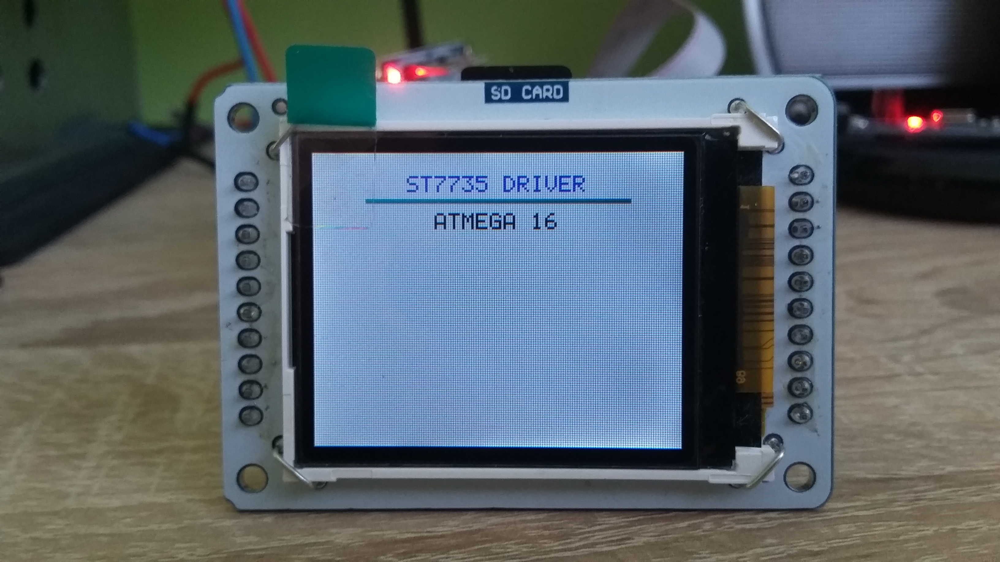

# LCD 162x132

## ST7735 Description
Detailed information are described in [Datasheet ST7735](http://www.displayfuture.com/Display/datasheet/controller/ST7735.pdf).

## Library
C library is aimed for driving [ST7735 1.8 TFT LCD display](img/st7735.jpg) through SPI's Atmega16 / Atmega8.

| PORT  | [Atmega16](http://ww1.microchip.com/downloads/en/devicedoc/doc2466.pdf) | [Atmega8](https://ww1.microchip.com/downloads/en/DeviceDoc/Atmel-2486-8-bit-AVR-microcontroller-ATmega8_L_datasheet.pdf) |
| :---: | :---: | :---: |
| SS | PB4 | PB2 |
| MOSI | PB5 | PB3 |
| MISO | PB6 | PB4 |
| SCK | PB7 | PB5 |
  
## Demonstration

## Links
- [Datasheet ST7735](http://www.displayfuture.com/Display/datasheet/controller/ST7735.pdf)
- [Adafuit TFT](https://github.com/adafruit/Adafruit-ST7735-Library)
- [AVR TFT](http://w8bh.net/avr/AvrTFT.pdf)
