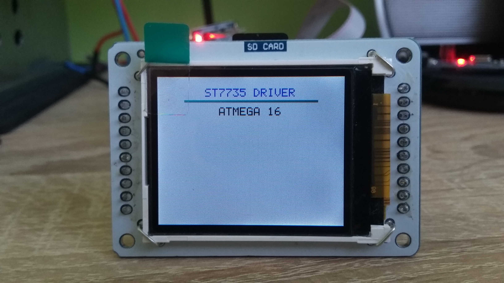

# 1.8 TFT LCD
<h2> St7735 driver</h2>

1.8 TFT LCD Driver St7735 for AVR Atmega16

C library for driving 1.8 TFT LCD display with controller st7735 through SPI's Atmega16

<h2>Demonstration</h2>

<h2>Inspiration, Acknowledge</h2>

https://github.com/adafruit/Adafruit-ST7735-Library
